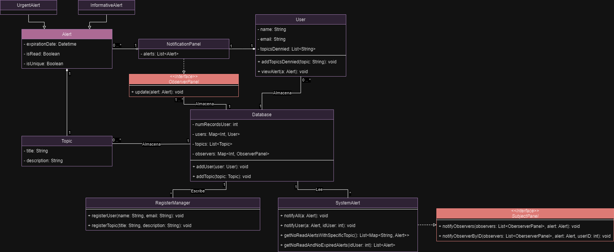

# Sistema-de-alertas

## 1. Technologies

Name| Version |Description
----|---------|-----------
Java| 1.8     |JDK
Junit| 4.13.2  |UnitTest for Java
Maven| -       | Maven automates the build process and dependency management for Java projects.
commons-validator| 1.9.0   |Email Validator

## 2. Directories

- `/` contains README and the rest of the directories.
- `SQL/` has the SQL exercise.
- `src/` contains main and test directories.
  - `src/main/java/src/..` contains the SystemAlert class and the rest of the system
  - `src/test/` contains the unit tests.

## 3. Database

The database class implements a singleton pattern, to use to get the instance.

## 4. Class diagram

